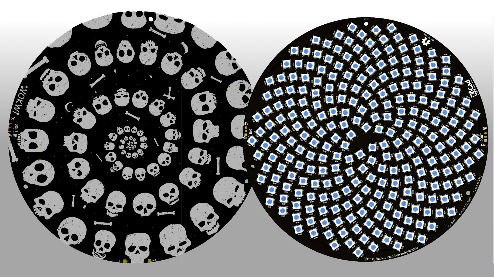

# Splendida! ✨

> 256 RGB LEDs beautifully packed in Fermat's Spiral shape

[][cc-by-sa]

The [PCB](pcb/) was designed with [KiCad](https://kicad.org/) and laid out using a [Python script](pcb/layout-board.py).

The design was inspired by Evil Genious Labs' [Fibonacci 256](https://www.evilgeniuslabs.org/fibonacci256).

## Specifications

- 256 WS2812B-B RGB LEDs
- 256 100nF decoupling capacitors
- 2 sets of 3-pin header connectors with standard 0.1" spacing:
  - `5V`, `DIN`, `GND`
  - `5V`, `DOUT`, `GND`
- 172mm board diameter
- 3xM3 mounting holes (81.5mm from center)
- Hypnotic skull spiral decoration 💀

## Power consumption

| Test condition                     | Current | Power  |
| ---------------------------------- | ------- | ------ |
| Standby (all LEDs off)             | 0.16A   | 0.8W   |
| Maximum brightness, rainbow colors | 3.75A   | 18.75W |
| Maximum brightness, all LEDs white | 9.21A   | 46W    |

## 3D Models

- [Splendida 3D Model](3d/splendida.stl) (OpenSCAD [source code](3d/spelndida.scad))
- [Diffuser by ldirko](3d/ldirko-diffuser.stl) (also available on [Thingiverse](https://www.thingiverse.com/thing:4782141))

## Pixelblaze map

To use with Pixelblaze, load [this map file](pizelblaze-map.json). For more information, check out the [Mapping in Pixelblaze guide](https://www.bhencke.com/mapping-in-pixelblaze).

## License

This work is licensed under a
[Creative Commons Attribution-ShareAlike 4.0 International License][cc-by-sa].

[][cc-by-sa]

The Python scripts are released under the terms of the GNU General Public License(GPL) version 3 or greater.

[cc-by-sa]: http://creativecommons.org/licenses/by-sa/4.0/
